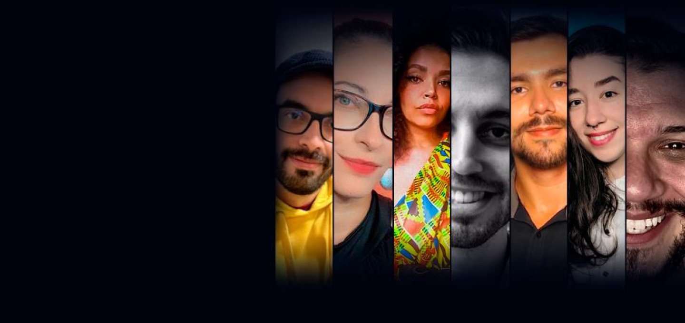

<h1>Este é o Alura+</h1>

Projeto de landing page de streaming criada com HTML e CSS. Neste projeto, foram usadas as técnicas CSS grid e flexbox para posicionamento, além do tilt.js para efeito nos elementos.

 

 

Veja este projeto em: <a href="alura-plus-orpin-ten.vercel.app">alura-plus-orpin-ten.vercel.app</a>

